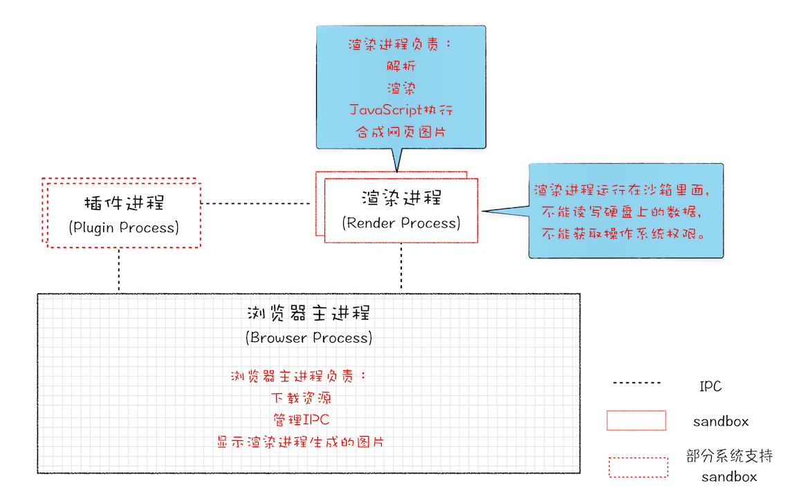
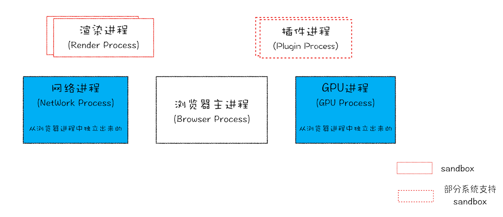

# chrome 架构：1 个页面，4 个进程？

当今的主流浏览器如 Edge，chrome 和众多国产浏览器大部分都是基于 Chromium 开发而来，chrome 又是 Google 的官方发行版，特性和 Chromium 基本一样，只存在一些产品层面差异，所以在学习浏览器的工作原理时我们一般选择基于 chrome。

## 线程和进程

**线程**可以让计算机在同一时刻处理多个任务，即**并行处理**。
一个**进程**就是一个程序的运行实例：启动一个程序的时候，操作系统会为该程序创建一块内存，用来存放代码、运行中的数据和一个执行任务的主线程，我们把这样的一个运行环境叫进程。
线程依附于进程:

它们的关系主要有以下四个特点：

1. 进程中的任意一个线程出错，都会导致整个进程的崩溃。
2. 同一个进程的线程之间可以共享进程中的数据。
3. 当一个进程结束后，操作系统会回收进程占用的资源。
4. 进程之间的内容相互隔离，如果需要通信，就要使用 IPC 机制了。

## 浏览器架构演进

### 单进程浏览器

在 chrome 发布之前，基本所有的浏览器都是单进程的，浏览器的所有功能模块都是运行在同一个进程里，这些模块包含了网络、插件、JavaScript 运行环境、渲染引擎和页面等。

从上面的进程与线程的特点中我们可以看出单进程浏览器由于进程的单一，很容易导致浏览器：

1. 不稳定：插件和渲染引擎模块往往不稳定，容易导致真个浏览器进程卡死。
2. 不流畅：如果一段 js 脚本导致阻塞，整个页面线程都将被阻塞，这样就会导致整个浏览器失去响应，变卡顿。除此之外由于浏览器内核的复杂性，关闭标签页的时候往往不能彻底回收内存，会导致浏览器越用越卡。
3. 不安全：插件或者浏览器脚本可以通过浏览器漏洞获取系统权限，从而引发安全性问题

### 多进程浏览器

#### 早期多进程架构

下图是 08 年 chrome 刚发布时的架构图：

如果所示，在浏览器主进程之外，每个页面拥有自己的渲染进程，插件也有自己的插件进程，进程之间通过 IPC 进行通信。这种架构很好的解决了单进程浏览器的问题:

1. 解决不稳定：当某个页面的渲染进程或者某个插件崩溃时，不会影响到其他页面或者其他插件的进程。
2. 解决不流畅：当某个页面的渲染进程被脚本阻塞时，不会影响其他页面的渲染。同时当标签页被关闭时，相应的进程也被关闭，进程资源也会被系统回收，这样也解决了页面的内存泄露问题。
3. 解决不安全：插件和渲染进程被放入沙箱中执行，沙箱相当于系统给进程的一把锁，相关进程不能在硬盘写入数据或者读取敏感数据，也不能获取系统关键权限。

#### 目前的多进程架构

随着现在 web 端可以实现的功能越来越复杂，样式越来越炫酷，现在的多进程架构又发生了改变：

可以看到，目前最新的 Chrome 浏览器包括：1 个浏览器（Browser）主进程、1 个 GPU 进程、1 个网络（NetWork）进程、多个渲染进程和多个插件进程。

- 浏览器进程：主要负责界面显示、用户交互、子进程管理，同时提供存储等功能。
- 渲染进程：核心任务是将 HTML、CSS 和 JavaScript 转换为用户可以与之交互的网页，排版引擎 Blink 和 JavaScript 引擎 V8 都是运行在该进程中，默认情况下，Chrome 会为每个 Tab 标签创建一个渲染进程。出于安全考虑，渲染进程都是运行在沙箱模式下。
- GPU 进程：其实，Chrome 刚开始发布的时候是没有 GPU 进程的。而 GPU 的使用初衷是为了实现 3D CSS 的效果，只是随后网页、Chrome 的 UI 界面都选择采用 GPU 来绘制，这使得 GPU 成为浏览器普遍的需求。最后，Chrome 在其多进程架构上也引入了 GPU 进程。
- 网络进程：主要负责页面的网络资源加载。之前是作为一个模块运行在浏览器进程里面。
- 插件进程：主要是负责插件的运行，因插件易崩溃，所以需要通过插件进程来隔离，以保证插件进程崩溃不会对浏览器和页面造成影响。

因此题目中的问题也有了解答：打开 1 个页面至少需要 1 个网络进程、1 个浏览器进程、1 个 GPU 进程以及 1 个渲染进程，共 4 个；如果打开的页面有运行插件的话，还需要再加上 1 个插件进程。

::: tip
Chrome 的默认策略是，每个标签对应一个渲染进程。但是如果从一个页面打开了新页面，而新页面和当前页面属于同一站点时，那么新页面会复用父页面的渲染进程。官方把这个默认策略叫 process-per-site-instance。
因为在一个渲染进程里面，他们就会共享 JS 的执行环境，也就是说 A 页面可以直接在 B 页面中执行脚本，如果是同一家的站点，是可能有这个需求的。
:::

### 未来面向服务的架构

凡事都有两面性，虽然多进程模型提升了浏览器的稳定性、流畅性和安全性，但同样不可避免地带来了一些问题：

- 更高的资源占用：每个进程都会包含公共基础结构的副本（如 JavaScript 运行环境），这就意味着浏览器会消耗更多的内存资源。
- 更复杂的结构：浏览器各模块之间耦合度高，难以扩展，无法适应新的需求。

为了解决这些问题，在 2016 年，Chrome 官方团队使用“面向服务的架构”（Services Oriented Architecture，简称 SOA）的思想设计了新的 Chrome 架构。也就是说 Chrome 整体架构会朝向现代操作系统所采用的“面向服务的架构” 方向发展，原来的各种模块会被重构成独立的服务（Service），每个服务（Service）都可以在独立的进程中运行，访问服务（Service）必须使用定义好的接口，通过 IPC 来通信，从而构建一个更内聚、松耦合、易于维护和扩展的系统，更好实现 Chrome 简单、稳定、高速、安全的目标。

Chrome 最终要把 UI、数据库、文件、设备、网络等模块重构为基础服务，类似操作系统底层服务，下面是 Chrome“面向服务的架构”的进程模型图：

前 Chrome 正处在老的架构向服务化架构过渡阶段，这将是一个漫长的迭代过程。
