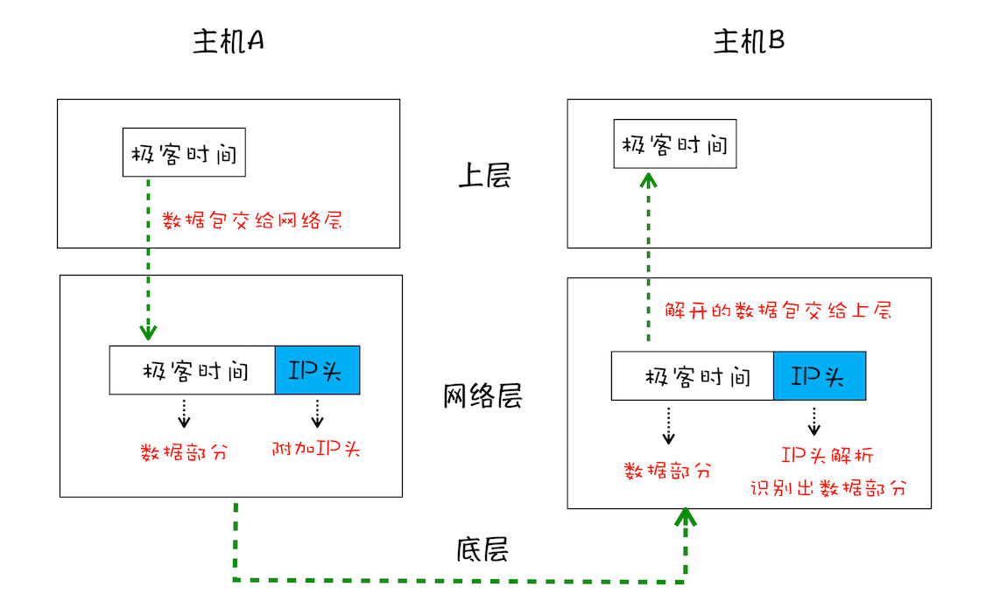
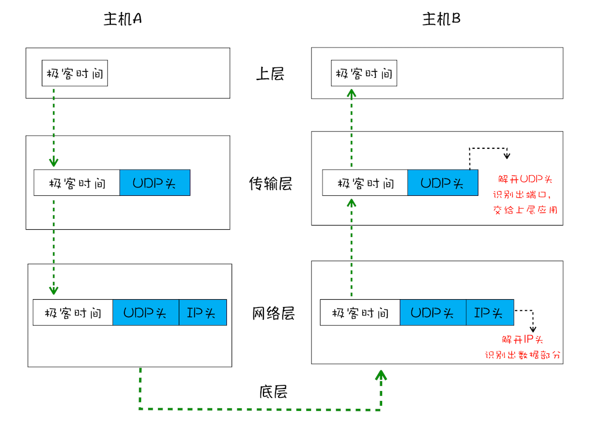

# TCP 协议：如何保证页面文件能被完整送达浏览器？

要想优化 Web 页面的加载速度，需要对网络有充分的了解。而理解网络的关键是要对网络协议有深刻的认识，不管你是使用 HTTP，还是使用 WebSocket，它们都是基于 TCP/IP 的，如果你对这些原理有足够了解，也就清楚如何去优化 Web 性能，或者能更轻松地定位 Web 问题了。此外，TCP/IP 的设计思想还有助于拓宽你的知识边界，从而在整体上提升你对项目的理解和解决问题的能力。

## 1 个“数据包”的旅程

互联网，实际上是一套理念和协议组成的体系架构。其中，协议是一套众所周知的规则和标准，如果各方都同意使用，那么它们之间的通信将变得毫无障碍。互联网中的数据是通过数据包来传输的。如果发送的数据很大，那么该数据就会被拆分为很多小数据包来传输。比如你现在听的音频数据，是拆分成一个个小的数据包来传输的，并不是一个大的文件一次传输过来的。

### 1.IP：将数据包送达目的主机

数据包要在互联网上进行传输，就要符合网际协议（Internet Protocol，简称 IP）标准。

计算机的地址就称为 IP 地址，访问任何网站实际上只是你的计算机向另外一台计算机请求信息。

如果要想把一个数据包从主机 A 发送给主机 B，那么在传输之前，数据包上会被附加上主机 B 的 IP 地址信息，这样在传输过程中才能正确寻址。额外地，数据包上还会附加上主机 A 本身的 IP 地址，有了这些信息主机 B 才可以回复信息给主机 A。这些附加的信息会被装进一个叫 IP 头的数据结构里。IP 头是 IP 数据包开头的信息，包含 IP 版本、源 IP 地址、目标 IP 地址、生存时间等信息。

为了方便理解，可以先把网络简单分为三层结构，如下图：

### 2.UDP：将数据包送达应用程序

有了 IP 协议，我们可以将数据包送到指定的主机，但是目标主机在收到数据包后并不知道要将数据给哪个程序，因此我们还需要在 IP 协议基础上有一个能和应用打交道的协议，最常见的即 UDP 协议（用户数据包协议（User Datagram Protocol））。

计算机中的程序想要访问网络，都会绑定一个端口号，UDP 协议在 IP 数据包的基础上添加了 UDP 头，UDP 头中包含目标端口号，源端口号等信息，这样在目标主机收到 UDP 数据包后就能解析出目标程序的端口，从而将数据送给需要的程序。

有了 UDP 之后的网络简化四层模型：

在使用 UDP 发送数据时，有各种因素会导致数据包出错，虽然 UDP 可以校验数据是否正确，但是对于错误的数据包，UDP 并不提供重发机制，只是丢弃当前的包，而且 UDP 在发送之后也无法知道是否能达到目的地。虽说 UDP 不能保证数据可靠性，但是传输速度却非常快，所以 UDP 会应用在一些关注速度、但不那么严格要求数据完整性的领域，如在线视频、互动游戏等。

### 3.TCP：将数据完整的送达应用程序

对于可靠性要求高的场景中，使用 UDP 传输会存在两个问题：

- 数据包容易丢失;
- 对于大文件拆分的小数据包，在经过不同的路由后，这些数据包并不能保证同时到达接收端，UDP 协议不知道如何组装这些数据包从而还原原始的大文件。

TCP 协议可以解决这些问题。

TCP（Transmission Control Protocol，传输控制协议）是一种面向连接的、可靠的、基于字节流的传输层通信协议。相对于 UDP，TCP 有下面两个特点:

- 对于数据丢失提供重传机制；
- 对于小的数据包，TCP 引入了排序机制，用来把乱序的数据包还原为原始文件。

和 UDP 头一样，TCP 头除了包含了目标端口和本机端口号外，还提供了用于排序的序列号，以便接收端通过序号来重排数据包。

一个完整的 TCP 连接过程包括“建立连接”，“传输数据”，“断开连接”三个阶段：

- 首先，建立连接阶段。这个阶段是通过“三次握手”来建立客户端和服务器之间的连接。TCP 提供面向连接的通信传输。面向连接是指在数据通信开始之前先做好两端之间的准备工作。所谓三次握手，是指在建立一个 TCP 连接时，客户端和服务器总共要发送三个数据包以确认连接的建立。
- 其次，传输数据阶段。在该阶段，接收端需要对每个数据包进行确认操作，也就是接收端在接收到数据包之后，需要发送确认数据包给发送端。所以当发送端发送了一个数据包之后，在规定时间内没有接收到接收端反馈的确认消息，则判断为数据包丢失，并触发发送端的重发机制。同样，一个大的文件在传输过程中会被拆分成很多小的数据包，这些数据包到达接收端后，接收端会按照 TCP 头中的序号为其排序，从而保证组成完整的数据。
- 最后，断开连接阶段。数据传输完毕之后，就要终止连接了，涉及到最后一个阶段“四次挥手”来保证双方都能断开连接。

可以看出，TCP 为了保证数据传输的可靠性，牺牲了数据包的传输速度，因为“三次握手”和“数据包校验机制”等把传输过程中的数据包的数量提高了一倍。
