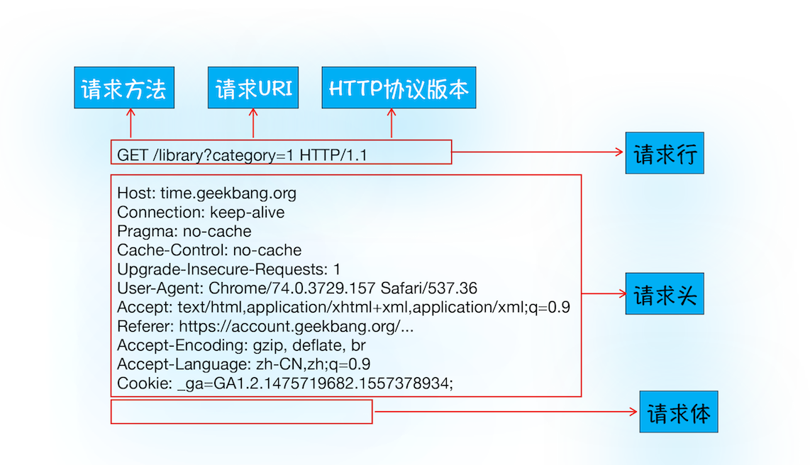
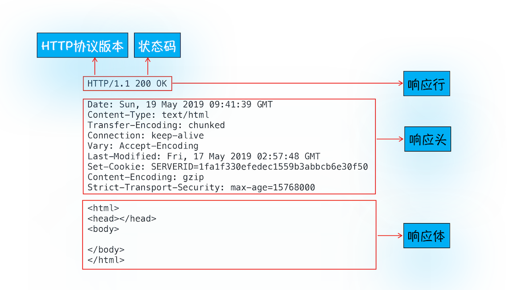
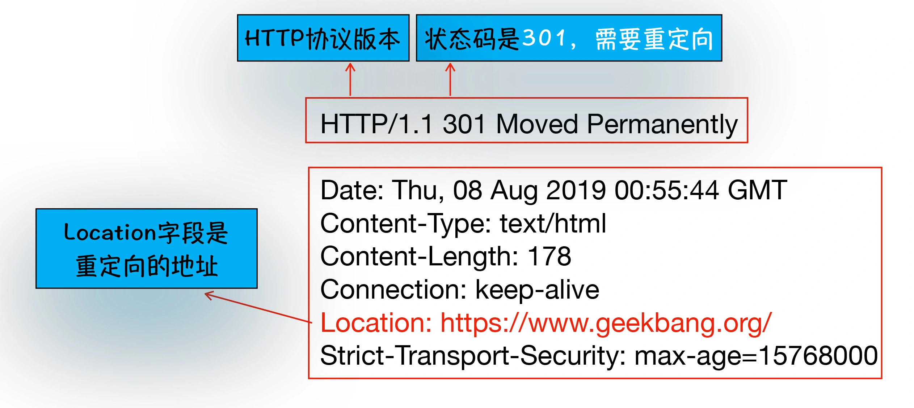

# HTTP 协议简述

## 什么是 HTTP 协议

HTTP 即**超文本传输协议**，它建立在 TCP 协议之上，是一个用于传输超媒体文档（例如 HTML）的**应用层**协议。它是为 Web 浏览器与 Web 服务器之间的通信而设计的，但也可以用于其他目的。HTTP 遵循经典的客户端—服务端模型，客户端打开一个连接以发出请求，然后等待直到收到服务器端响应。HTTP 是**无状态**协议，这意味着服务器不会在两个请求之间保留任何数据（状态）。

## 浏览器发起 HTTP 请求的流程

下面是当我们访问一个网址，例如[百度](https://time.geekbang.org/)，浏览器请求过程中的一系列动作：

### 1.构建请求

浏览器构建请求行信息，构建好后发起请求：

```shell
GET /index.html HTTP1.1
```

### 2.查找缓存

在发起网络请求之前，浏览器会查询本地缓存中是否已有要请求资源的副本，如果有，直接拦截并结束请求。

### 3.查找 IP 地址和端口

如果没有找到缓存，浏览器将发起网络请求。首先要获取当前请求域名的 IP 地址及端口号。

浏览器会先查询本地 DNS 缓存时候有当前请求域名的查询记录，如果没有则请求 DNS 查询域名对应的 IP 地址。

如果 url 没有指明特定的端口号，http 请求默认为 80 端口。（https 为 443）

### 4.等待 TCP 队列

在获得 IP 地址和端口号之后，理论上应该建立 TCP 连接了，但是这里还有一个前置条件：

Chrome 有一个机制：同一个域名同时最多只能建立 6 个 TCP 连接，超过的连接将进入队列等待。

当请求数量小于 6 时，会进入下一步，建立 TCP 连接。

:::tip
http/1.1 一个 tcp 同时只能处理一个请求，浏览器会为每个域名维护 6 个 tcp 连接，但是每个 tcp 连接是可以复用的，也就是处理完一个请求之后，不断开这个 tcp 连接，可以用来处理下个 http 请求。

不过 http2 是可以并行请求资源的，所以如果使用 http2，浏览器只会为每个域名维护一个 tcp 连接。
:::

### 5.建立 TCP 连接

浏览器通过 TCP 与服务器建立连接，过程可参考[上一章](../1.2TCP%E5%8D%8F%E8%AE%AE/index.md)。

### 6.发送 HTTP 请求

一旦建立了 TCP 连接，浏览器就可以和服务器进行通信了。而 HTTP 中的数据正是在这个通信过程中传输的。



## 服务端处理 HTTP 请求过程

### 1.返回请求

一旦服务器处理结束，便可以返回数据给浏览器了。可以通过工具软件 curl 来查看返回请求数据：

```shell
curl -i www.baidu.com
```


可以看到返回的结果可以分为响应行、响应头、响应体，如下图所示：



- 响应行：包含协议版本和状态码
- 响应头：包含服务器自身的一些信息，如服务器生成返回数据的时间、返回的数据类型（JSON、HTML、流媒体等类型），以及服务器要在客户端保存的 Cookie 等信息。
- 响应体：通常即为 HTML 的实际内容

### 2.断开连接

通常情况下，一旦服务器向客户端返回了请求数据，它就要关闭 TCP 连接。不过如果浏览器或者服务器在其头信息中加入了：Connection:Keep-Alive 那么 TCP 连接在发送后将仍然保持打开状态，这样浏览器就可以继续通过同一个 TCP 连接发送请求。

**保持 TCP 连接可以省去下次请求时需要建立连接的时间，提升资源加载速度。**

比如，一个 Web 页面中内嵌的图片就都来自同一个 Web 站点，如果初始化了一个持久连接，你就可以复用该连接，以请求其他资源，而不需要重新再建立新的 TCP 连接。

### 3.重定向

当服务端返回的状态码为 301，或 302 时，即告诉浏览器需重定向到另外一个网址，而需要重定向的网址正是包含在响应头的 Location 字段中。

例如输入的是 `geekbang.org`，最终打开的却是 [https://www.geekbang.org](https://www.geekbang.org) 了。

```shell
curl -I geekbang.org
```


:::tip
301 与 302 的区别：
301：永久重定向，浏览器可缓存，不用每次都访问服务器
302：临时重定向，每次都会访问对方服务器
:::

## 浏览器缓存：提高二次加载速度

- DNS 缓存
- 页面资源缓存
  
