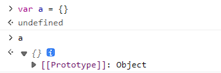

# 原型链与继承

## [[Prototype]]

在 Javascript 中，每个对象都有一个特殊属性`[[Prototype]]`，这个属性为 null 或者另一个对象的引用，该对象被称为“原型对象”。



### 读取[[Prototype]]

1. 通过`Object.getPrototypeOf()`函数访问。
2. 通过`__proto__`属性访问。
   ::: warning 注意
   `__proto__` 是 [[Prototype]] 的因历史原因而留下来的 getter/setter。它已经过时，虽然它被众多浏览器环境甚至服务端环境支持，我们也应该避免使用`__proto__`读取原型。
   :::

```js
var a = {}
Object.getPrototypeOf(a) === a.__proto__ // true
```

### 设置[[Prototype]]

1. 通过`Object.setPrototypeOf()` 函数设置。
2. 对象定义时通过`__proto__`属性设置。
   ::: tip `{ __proto__: ... }` 语法与 `obj.__proto__` 访问器不同：前者是标准且未被弃用的。
   :::
