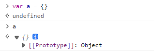

# 原型链与继承

与基于类的语言（如 Java 或 C++）不同，JavaScript 是动态的，没有静态类型。由此 JavaScript 也有不同于类式模型的继承方式，即“原型继承模型”。

在 JS 中，每个对象（object）都有一个私有属性指向另一个名为原型（prototype）的对象。原型对象也有一个自己的原型，层层向上直到一个对象的原型为 null。
根据定义，null 没有原型，并作为这个原型链（prototype chain）中的最后一个环节。

原型链中的任何成员都可以被改变，甚至可以在运行时换出原型，因此 JavaScript 中不存在静态分派的概念。

## [[Prototype]]

JS 中对象的私有属性，指向自身的“原型对象”。



### 读取[[Prototype]]

1. 通过`Object.getPrototypeOf()`函数访问。
2. 通过`__proto__`属性访问。
   ::: warning 注意
   `__proto__` 是 [[Prototype]] 的因历史原因而留下来的 getter/setter。它已经过时，虽然它被众多浏览器环境甚至服务端环境支持，我们也应该避免使用`__proto__`读取原型。
   :::

```js
let a = {}
Object.getPrototypeOf(a) === a.__proto__ // true
```

### 设置[[Prototype]]

`[[Prototype]]`属性时内部的并且是隐藏的，可以通过以下方法设置它：

1. 通过`Object.setPrototypeOf()` 函数设置。
2. 定义对象时通过`__proto__`属性设置。
   ::: tip `{ __proto__: ... }` 语法与 `obj.__proto__` 访问器不同：前者是标准且未被弃用的。
   :::

原型链可以很长：

```js
let animal = {
  eats: true,
  walk() {
    alert('Animal walk')
  },
}

let rabbit = {
  jumps: true,
  __proto__: animal,
}

let longEar = {
  earLength: 10,
  __proto__: rabbit,
}

// walk 是通过原型链获得的
longEar.walk() // Animal walk
alert(longEar.jumps) // true（从 rabbit）
```

设置原型时有两个限制：

1. 引用不能形成闭环
2. 值只能是对象或者 null，其他值将被忽略

### 原型仅限于读取操作

下面的代码中，给 rabbit 对象赋值并不会覆盖其原型对象 animal 上的 walk，即“写、删除”操作不会修改原型对象。

```js
let animal = {
  eats: true,
  walk() {
    /* rabbit 不会使用此方法 */
  },
}

let rabbit = {
  __proto__: animal,
}

rabbit.eat = false
rabbit.walk = function () {
  alert('Rabbit! Bounce-bounce!')
}

alert(rabbit.eat) // false
rabbit.walk() // Rabbit! Bounce-bounce!
```

### this 指向

无论是从对象自身还是原型上找到的方法，在方法调用时，this 始终是点符号`.`前面的对象。

```js
let foo = {
  name: 'foo',
  getName() {
    alert(this.name)
  },
}

let bar = {
  __proto__: foo,
  name: 'bar',
}

bar.getName() // 'bar'
```

## F.prototype

每一个函数都有 prototype 属性，且**只有函数**有 prototype 属性。

```js
function Person() {}

console.log(Person.prototype) // {constructor: Person}

const a = {}

console.log(a.prototype) // undefined
```


::: warning 注意
这里的 F.prototype 指的是 F 的一个名为 "prototype" 的常规属性。这听起来与“原型”这个术语很类似，但实际上指的是具有该名字的常规属性。
:::

这个属性指向一个对象，在函数被作为构造函数使用时，这个对象即是构造出来的实例对象的原型([[Prototype]])。

```js{9}
let animal = {
  eats: true,
}

function Rabbit(name) {
  this.name = name
}

Rabbit.prototype = animal

let rabbit = new Rabbit('White Rabbit') //  rabbit.__proto__ == animal

alert(rabbit.eats) // true
```

如果在创建之后，F.prototype 属性有了变化（`F.prototype = <another object>`），那么通过 new F 创建的新对象也将随之拥有新的对象作为 [[Prototype]]，但已经存在的对象将保持旧有的值。


### constructor

一个构造函数可以构造多个实例，所以 prototype 没有指向实例的属性。但是 prototype 属性对于函数来说则是一对一的，prototype 的 constructor 属性指向对应的构造函数。

```js
function Person() {}
let person = new Person()
console.log(Person === Person.prototype.constructor) // true
console.log(Person === person.constructor) // true
// person并没有constructor属性，会从原型中即Person.prototype中读取。
```

## 原型链

当从对象中读取一个缺失属性时，JS 会自动尝试从其原型链上的对象中获取该属性。对象都是由 Object 构造函数生成的，所以最终会找到 Object 的 prototype。再往上找的话，会发现 `Object.prototype.__proto__ === null`，即原型链的尽头。


## 继承

### 真的是继承吗？

前面我们讲到“每一个对象都会从原型‘继承’属性”，实际上，继承是一个十分具有迷惑性的说法，引用《你不知道的 JavaScript》中的话，就是：
继承意味着复制操作，然而 JavaScript 默认并不会复制对象的属性，相反，JavaScript 只是在两个对象之间创建一个关联，这样，一个对象就可以通过委托访问另一个对象的属性和函数，所以与其叫继承，委托的说法反而更准确些。
