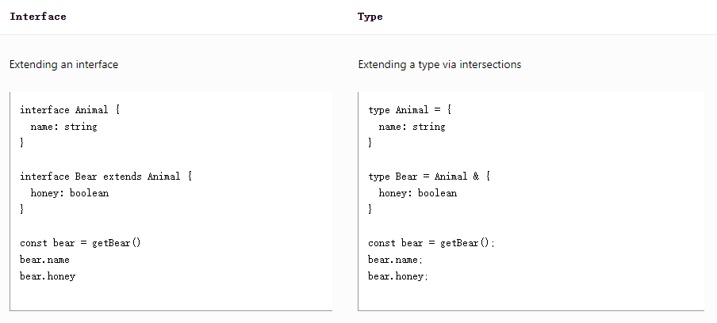
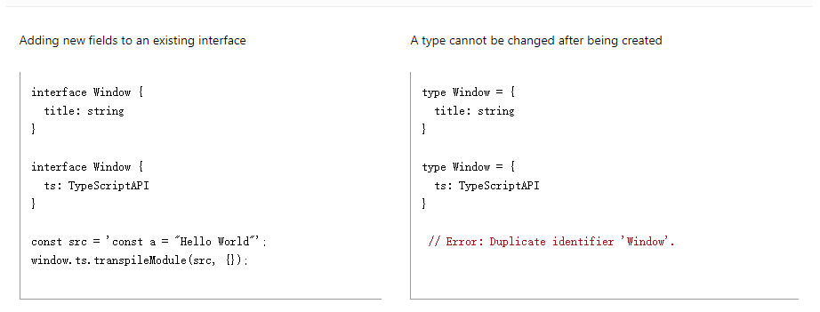

# 常用类型

TypeScript 为 JavaScript 添加了类型系统，它可以检查代码中的意外行为，从而降低出现错误的机会。

## primitives（原始类型）

对于 JS 中常见的三种原始值：`string`, `number`,`boolean`，在 TS 中也存在其对应的类型。

对于原始值，TS 可以自主推断出对应的类型:

```typescript
// *布尔boolean
let bool: boolean = true

// *数值
let num: number = 123
num = 0b111 // 二进制
num = 0o173 // 八进制
num = 0x7b // 十六进制

// *字符串
let str: string = 'abc'
str = `数值位：${num}`
```

> `String`,`Boolean`，`Number`作为类型声明也是可以的，但请总是使用`string, number, or boolean`。

## Arrays

```typescript
let arr1: number[] = [1, 2, 3]
let arr2: Array<number> = [1, 2, 3]
let arr3: (number | string)[] = ['1', 2, 3]
```

## Tuple

元组是 TS 中特有的类型，可看作长度及成员类型固定的数组:

```typescript
let tuple: [string, number, boolean] = ['1', 2, true]
```

## Functions

**基础：**

```typescript
let add: (x: number, y: number) => number
```

```typescript
type Add = (x: number, y: number) => number

const addFunc: Add = (arg1: number, arg2: number) => arg1 + arg2
```

**可选参数：**

```typescript
type AddFunc1 = (x: number, y: number, c?: number) => number
```

**默认参数：**

```typescript
const addFunc = (arg1: number, arg2 = 2) => arg1 + arg2
```

**剩余参数：**

```typescript
const handleData = (arg1: number, ...args: number[]) => {
  // ...
}
```

**重载：**

```typescript
function handleData1(x: number): number[]
function handleData1(x: string): string[]
function handleData1(x: any): any {
  if (typeof x === 'number') {
    return x
      .toString()
      .split('')
      .map((i) => Number(i))
  } else {
    return x.split('')
  }
}
```

匿名函数：

对于匿名函数，TS 在可以知道它将被如何调用时会自动推断函数的参数类型：

```typescript
const names = ["Alice", "Bob", "Eve"];

// Contextual typing for function
names.forEach(function (s) {
  console.log(s.toUppercase());
Property 'toUppercase' does not exist on type 'string'. Did you mean 'toUpperCase'?
});
```

## Object

声明 JS 中的对象属性的类型：

**基础：**

```typescript
// 属性之间使用;分隔，如果没有执行，则为any
function printCoord(pt: { x: number; y: number }) {
  console.log("The coordinate's x value is " + pt.x)
  console.log("The coordinate's y value is " + pt.y)
}
printCoord({ x: 3, y: 7 })
```

**可选属性：**

```typescript
function printName(obj: { first: string; last?: string }) {
  // ...
}
// Both OK
printName({ first: 'Bob' })
printName({ first: 'Alice', last: 'Alisson' })
```

在 JS 中，访问对象上没有的属性会得到`undefined`，所以在访问可选属性前应该先判断其不为`undefined`或者使用链式符调用:

```typescript
function printName(obj: { first: string; last?: string }) {
  if (obj.last !== undefined) {
    // OK
    console.log(obj.last.toUpperCase())
  }

  // A safe alternative using modern JavaScript syntax:
  console.log(obj.last?.toUpperCase())
}
```

## object

TS 中的`object`类型只除了原始值（string, number, bigint, boolean, symbol, null, or undefined）外的任何类型。这和空对象类型`{}`以及全局类型`Object`不同。

> 永远不要使用 Object，要使用 object。

## any

`any`是 TS 特有的一种特殊类型，可以在我们不希望某个特定值引起类型错误时使用。

它既是 TS 中的`TOP`类型，也是`bottom`类型，即他是任何类型的子类型，任何其他类型也是它的子类型，这意味着使用 any 等于基本放弃了类型检查。

这在我们不想为了通过某个特性的类型检查而要编写大量的类型定义时很有用。

```typescript
// any是任何类型的子类型
// 编写代码时无法获取准确类型的情况
// 不建议使用，万不得已的时候可以用
let value: any
```

> **noImplicitAny**
>
> 虽然使用 any 很方便，但这也使我们失去了 TS 类型检查的优势。我们可以在编译配置中开启此选项以提示所有的 any 错误。

## unknown

TypeScript 3.0 中引入的 `unknown` 类型也被认为是 `top type`，但它相比于`any`更加安全。

与`any`一样，任何其他类型都可以赋值给`unknown`类型，但是`unknown`类型的值只能复制给`any和unknown`类型。

和`any`不同，在不缩小类型时，我们无法对`unknown`类型执行任何操作：

```typescript
function getString() {
  return 'hello'
}

const str: unknown = getString()
str.toLowerCase() //Object is of type 'unknown'
```

我们需要对`unknown`类型进行类型收缩：

```typescript
function getString() {
  return 'Hello'
}

const str: unknown = getString()
// 使用断言
;(str as string).toLowerCase //Object is of type 'unknown'
// 使用typeof
if (typeof str === 'string') {
  console.log(str.toLowerCase())
}
// 使用instanceof
if (str instanceof String) {
  console.log(str.toLowerCase())
}
```

## null and undefined

两者在 JS 中作为基础类型用来标志空值或未定义的值，在 TS 中两者既是值也是类型。

在 TS 中两者的行为取决于`strictNullChecks`的开启和关闭：

- `strictNullChecks`关闭时，两者为其他类型的子类型，即`bottom`类型，可以被赋值给任何其它类型的值：

  ```typescript
  let u: undefined = undefined
  let n: null = null
  // num = u
  // num = v
  ```

- `strictNullChecks`开启时，再使用值上的属性或方法前我们需要判断其是否为 undefined 或 null：

  ```typescript
  function doSomething(x: string | null) {
    if (x === null) {
      // do nothing
    } else {
      console.log('Hello, ' + x.toUpperCase())
    }
  }
  ```

- 使用非空断言符`!`:
  ```typescript
  // 在值后加!标明此值必不为null或undefined
  function liveDangerously(x?: number | null) {
    // No error
    console.log(x!.toFixed())
  }
  ```

> 和其他类型断言方式一样，它不会改变运行时的行为，所以永远在我们百分百知道它不为空时使用！

## void

什么类型都不是，即’空‘。

常用在函数没有返回值的情况：

```typescript
const printFunc = (str: string): void => {
  console.log(str)
}
```

void 类型的值可以被赋给 undefined 或 null。

## never

是任意类型的子类型，但没有任何类型使它的子类型，除了 never 本身。

常用在抛错或死循环函数的返回值类型：

```typescript
const errorFunc = (message: string): never => {
  throw new Error(message)
}

const infiniteFunc = (): never => {
  while (true) {}
}
```

## Union Types（联合类型）

Typescript 的类型系统可以使用各种操作符从现有类型中构建新类型。

最常见的组合类型即**联合类型**。联合类型使用`|`连接多个类型，意味着定义的值满足其中一种类型即可

```typescript
function printId(id: number | string) {
  console.log('Your ID is: ' + id)
}
// OK
printId(101)
// OK
printId('202')
// Error: Argument of type '{ myID: number; }' is not assignable to parameter of type 'string | number'.
printId({ myID: 22342 })
```

当使用联合类型时，TS 仅支持我们使用每种类型上都存在的属性或方法：

```typescript
function printId(id: number | string) {
  console.log(id.toUpperCase());
Error: Property 'toUpperCase' does not exist on type 'string | number'.
  Property 'toUpperCase' does not exist on type 'number'.
}
```

在使用联合类型的值时需要先进行**类型断言**：

```typescript
# // typeof
function printId(id: number | string) {
  if (typeof id === "string") {
    // In this branch, id is of type 'string'
    console.log(id.toUpperCase());
  } else {
    // Here, id is of type 'number'
    console.log(id);
  }
}
// Array.isArray
function welcomePeople(x: string[] | string) {
  if (Array.isArray(x)) {
    // Here: 'x' is 'string[]'
    console.log("Hello, " + x.join(" and "));
  } else {
    // Here: 'x' is 'string'
    console.log("Welcome lone traveler " + x);
  }
}
// as
const getLength = (target: string | number): number => {
  if ((target as string).length || (target as string).length === 0) {
    return (target as string).length
  } else {
    return target.toString().length
  }
}
```

## Type Aliases（类型别名）

```typescript
type Point = {
  x: number
  y: number
}

type ID = number | string
```

## Interfaces（接口）

接口声明 是命名对象类型的另一种形式：

```typescript
interface Point {
  x: number
  y: number
}

function printCoord(pt: Point) {
  console.log("The coordinate's x value is " + pt.x)
  console.log("The coordinate's y value is " + pt.y)
}

printCoord({ x: 100, y: 100 })
```

就像我们上面使用类型别名时一样，这个示例的工作方式就像我们使用了匿名对象类型一样。 TypeScript 只关心我们传递给 printCoord 的值的结构 - 它只关心它是否具有预期的属性。 只关心类型的结构和功能，这就是为什么我们说 TypeScript 是一个 结构化类型 的类型系统。

### Interface 和 Type 的区别

接口声明和类型别名非常相似，绝大多数时候它们可以互相替换。`Interface`的所有功能`Type`几乎都支持，但它们也有一些区别：

1. `Type`可以通过`&`扩展新的属性，而`Interface`则通过继承：

   

2. `Type`一旦被创建就不能被覆盖，即不能再定义同名的`Type`，`Interface`则会合并同名的项：

   

3. `Interface`是中用来声明对象类型，而不能重新描述原始值：
   ```typescript
   type customString = string // 合法
   ```

## Type Assertions（类型断言）

有时候我们会比 TS 更了解一个值的类型，例如当我们使用`document.getElementById("main_canvas")`，TS 只知道其会返回一个`HTMLElement`，但我们可以确定通过`main_canvas`id 取到的元素必定是一个`HTMLCanvasElement `，这个时候我们可以使用类型断言来指定对应的类型：

```typescript
const myCanvas = document.getElementById('main_canvas') as HTMLCanvasElement
```

断言部分如同类型声明部分一样，在输出代码中会被移除。

在非`tsx`文件中，使用尖括号语法和 as 语法等价：

```typescript
const myCanvas = <HTMLCanvasElement>document.getElementById('main_canvas')
```

> 由于类型断言会在编译期间被移除，所以它不会在运行时有任何类型检查，所以当代码运行时也不会出现因为断言出错而导致的异常报错。

**断言只能从高级类型向更为具体的子类型转变**，例如 string 断言为 number 类型是不被允许的;

```typescript
const x = "hello" as number;
Error: Conversion of type 'string' to type 'number' may be a mistake because neither type sufficiently overlaps with the other. If this was intentional, convert the expression to 'unknown' first.
```

有时候，这个规则可能过于严格而使合法的复杂转变难以实现，这时候我们可以使用两次断言，先断言为`any`或`unknown`，再断言为目标类型：

```typescript
const a = expr as any as T
```

## Literal Types（字面量类型）

对于`string`或者`number`类型的值，它有时可以单独成为一个字面量类型：

由于 JS 中定义变量方式的不同，`let, var`定义的变量可以变化，而`const`定义的变量不允许修改，这使得`const`变量获得了一个等同于其值的字面量类型：

```typescript
let changingString = 'Hello World'
changingString = 'Olá Mundo'
// Because `changingString` can represent any possible string, that
// is how TypeScript describes it in the type system
changingString // type: string
```

```typescript
const constantString = 'Hello World'
// Because `constantString` can only represent 1 possible string, it
// has a literal type representation
constantString // type: "Hello World"
```

字面量类型不可以再改变：

```typescript
let x: 'hello' = 'hello'
// OK
x = 'hello'
// ...
x = 'howdy' // Error: Type '"howdy"' is not assignable to type '"hello"'.
```

这种变量只能为一个值的情况非常不常见，但我们可以组合多个字面量类型形成联合类型，这将变得很有用:

```typescript
function printText(s: string, alignment: 'left' | 'right' | 'center') {
  // ...
}
printText('Hello, world', 'left')
printText("G'day, mate", 'centre') // Error: Argument of type '"centre"' is not assignable to parameter of type '"left" | "right" | "center"'.
```

当然也可以将字面量类型与非字面量类型组合：

```typescript
interface Options {
  width: number
}
function configure(x: Options | 'auto') {
  // ...
}
configure({ width: 100 })
configure('auto')
configure('automatic') // Error
```

对于`boolean`类型，从上面我们可以推断出它就是`true, false`两个字面量类型的联合类型`true | false`。

### 字面量类型推断

当我们定义一个对象时，TS 推断其上面的属性稍后会发生变化，属性不会被定义为其当前所被赋值的字面量类型，而是被推断为范围较大的“父类型”，这是因为 TS 的类型系统同时定义了读和写操作时的类型：

```typescript
// counter不会被推断为'0'，而是'number'类型
const obj = { counter: 0 }
if (someCondition) {
  obj.counter = 1
}
```

这在某些情况下会触发类型报错：

```typescript
// @errors: 2345
declare function handleRequest(url: string, method: 'GET' | 'POST'): void
// ---cut---
const req = { url: 'https://example.com', method: 'GET' }
handleRequest(req.url, req.method)
// Error: Argument of type 'string' is not assignable to parameter of type '"GET" | "POST"'.
```

上面的报错是因为`req.method`被推断为了`string`类型，和函数参数定义的联合类型不匹配。

解决上面的问题，有两种方式：

1. 类型断言

   ```typescript
   // Change 1:
   const req = { url: 'https://example.com', method: 'GET' as 'GET' }
   // Change 2
   handleRequest(req.url, req.method as 'GET')
   ```

2. 使用 const 将整个对象的属性转换为字面量类型:
   ```typescript
   const req = { url: 'https://example.com', method: 'GET' } as const
   handleRequest(req.url, req.method)
   ```

## Enum

枚举类型是为数不多的 TS 对 JS 不限于类型层面的扩展。

它使我们对一种意图或者一类不同状态的定义和使用更为清晰。

TS 提供了数字和字符串类型的枚举类型。

### 数字枚举

- 不提供初始值，默认从零开始

  ```typescript
  enum Status {
    Success, // 0
    Error, // 1
    Warning, // 2
  }
  ```

- 提供初始值：

  ```typescript
  enum Direction {
    Up = 1, // Up使用初始化为 1。 其余的成员会从 1开始自动增长
    Down,
    Left,
    Right,
  }
  ```

  ```typescript
  const index = 0

  function getIndex() {
    return 1
  }

  enum Status {
    Success = index, // *如果首个值使用常量或者函数初始化，则后面的值也必须初始化
    Error = getIndex(),
    Warning = 2,
  }
  // or
  enum Status {
    Success, // *不适用常量或者函数初始化的值要放在前面
    Error = getIndex(),
    Warning = 2,
  }
  ```

### 字符串枚举

字符串枚举的概念很简单，但是有细微的 运行时的差别。

在一个字符串枚举里，每个成员都必须用字符串字面量，或另外一个字符串枚举成员进行初始化。

```typescript
enum Direction {
  Up = 'UP',
  Down = 'DOWN',
  Left = 'LEFT',
  Right = 'RIGHT',
}
```

由于字符串枚举没有自增长的行为，字符串枚举可以很好的序列化。 换句话说，如果你正在调试并且必须要读一个数字枚举的运行时的值，这个值通常是很难读的 - 它并不能表达有用的信息（尽管 反向映射会有所帮助），字符串枚举允许你提供一个运行时有意义的并且可读的值，独立于枚举成员的名字。

### 异构枚举（deprecated）

从技术的角度来说，枚举可以混合字符串和数字成员，但是似乎你并不会这么做：

```typescript
enum BooleanLikeHeterogeneousEnum {
  No = 0,
  Yes = 'YES',
}
```

### 枚举成员作类型

```typescript
enum BookType {
  Science,
  Computer,
}

interface ScienceBook {
  type: BookType.Science
}

const book1: ScienceBook = {
  type: BookType.Science,
}
```

### 枚举作联合类型

枚举类型本身变成了每个枚举成员的 联合：

```typescript
enum BookType {
  Science,
  Computer,
}

interface Book {
  type: BookType
}

const book2: Book = {
  type: BookType.Computer,
}
```

### 运行时的枚举

枚举是在运行时真正存在的对象。 例如下面的枚举：

```typescript
enum E {
  X,
  Y,
  Z,
}
```

可以被作为参数传入函数：

```typescript
function f(obj: { X: number }) {
  return obj.X
}

// Works, since 'E' has a property named 'X' which is a number.
f(E)
```

### 反向映射

除了创建一个以属性名做为对象成员的对象之外，数字枚举成员还具有了 反向映射，从枚举值到枚举名字。 例如，在下面的例子中：

```typescript
enum Enum {
  A,
}
let a = Enum.A
let nameOfA = Enum[a] // "A"
```

TypeScript 可能会将这段代码编译为下面的 JavaScript：

```typescript
var Enum
;(function (Enum) {
  Enum[(Enum['A'] = 0)] = 'A'
})(Enum || (Enum = {}))

var a = Enum.A
var nameOfA = Enum[a] // "A"
```

生成的代码中，枚举类型被编译成一个对象，它包含了正向映射（ name -> value）和反向映射（ value -> name）。 引用枚举成员总会生成为对属性访问并且永远也不会内联代码。

> 要注意的是 不会为字符串枚举成员生成反向映射。

### 常量枚举

为了避免额外生成代码上的开销和额外的非直接的对枚举成员的访问，我们可以使用 const 枚举。 常量枚举通过在枚举上使用 const 修饰符来定义：

```typescript
const enum Enum {
  A = 1,
  B = A * 2,
}
```

常量枚举只能使用常量枚举表达式，并且不同于常规的枚举，它们在编译阶段会被删除。 常量枚举成员在使用的地方会被内联进来。 之所以可以这么做是因为，常量枚举不允许包含计算成员。

```typescript
const enum Directions {
  Up,
  Down,
  Left,
  Right,
}

let directions = [
  Directions.Up,
  Directions.Down,
  Directions.Left,
  Directions.Right,
]
```

生成后的代码为：

```typescript
var directions = [0 /* Up */, 1 /* Down */, 2 /* Left */, 3 /* Right */]
```

## 不常见的原始类型

### bigint

从 ES2020 开始，JS 使用基本类型`Bigint`代表`large integers`:

```typescript
// Creating a bigint via the BigInt function
const oneHundred: bigint = BigInt(100)

// Creating a BigInt via the literal syntax
const anotherHundred: bigint = 100n
```

### symbol

ES6 中新增的基本类型，标识独一无二的值：

```typescript
const s1 = Symbol()
const s2 = Symbol()
console.log(s1 === s2) // false
```

可以传入字符串作标识，同样标识仍然不相等。初始化传入其他类型会先调用 toString 方法转换成字符串。TS 中初化只允许传入字符串或数字：

```typescript
const s3 = Symbol('hello')
const s4 = Symbol('hello')
console.log(s3 === s4) // false
```

Symbol 不能做运算:

```typescript
const a = Symbol('a')
const b = 1
const c = a + b // Error: Operator '+' cannot be applied to types 'unique symbol' and 'number'.
```

Symbol 可以转换成字符串，作布尔类型转换:

```typescript
const a = Symbol('a')
console.log(a.toString())
console.log(Boolean(a))
```

Symbol 作属性名可以保证属性不被其他任何属性覆盖，只能用自身属性名修改：

```
const s5 = Symbol('name')

const info = {
  [s5]: 'lushuo',
  age: 25,
  gender: 'male',
}
// 只能通过[]形式访问，不能使用.操作符
info[s5] = 'darren'
```

使用`Object.getOwnPropertySymbols()`或者`Reflect.ownKeys()`访问 Symbol 属性：

```typescript
// !以下方式访问不到Symbol作key的值
for (const key in info) {
  console.log(info[key])
}

Object.keys(info) // ['age', 'gender']

Object.getOwnPropertyNames(info) // ['age', 'gender']

JSON.stringify(info) // {"age":25,"gender":"male"}

// *下面方法可以获取到Symbol属性
Object.getOwnPropertySymbols(info) // [Symbol(name)]

Reflect.ownKeys(info) // ['age', 'gender', Symbol(name)]
```

Symbol 的方法，`for, keyfor`：

```typescript
// Symbol.for()
// 会在当前页面,iframe，service worker中寻找是否已经用此参数创建过Symbol,如果有，就创建索引
const s6 = Symbol.for('lushuo')
const s7 = Symbol.for('lushuo')
// console.log(s6 === s7) // true

// Symbol.keyFor()
// 返回通过Symbol.for创建的Symbol的标识
Symbol.keyFor(s6) // lushuo
```

11 个内置 Symbol 值：

```typescript
// 1.Symbol.hasInstance
// 当使用instanceof obj时就会调用通过Symbol.hasInstance作key的方法
// const obj1 = {
//   [Symbol.hasInstance](otherObj) {
//     console.log(otherObj)
//   },
// }

// console.log({ a: 'a' } instanceof <any>obj1)

// 2.Symbol.isConcatSpreadable
// 将数组的此属性设置为false，数组在concat中将不会被扁平化
// 默认为undefined，和true的效果相同
// let arr = [1, 2]
// arr[Symbol.isConcatSpreadable] = false
// console.log([].concat(arr, [3, 4]))

// 3.Symbol.species 指定创建衍生对象的构造函数

// 4.Symbol.match

let obj3 = {
  [Symbol.match](string) {
    console.log(string.length)
  },
}

'abcde'.match(<RegExp>obj3) // 5

// 5.Symbol.replace

// 6.Symbol.search

// 7.Symbol.split

// 8. Symbol.iterator
const iterator = arr[Symbol.iterator]()
console.log(iterator, iterator.next()) // {value: 1, done: false}

// 9.Symbol.toPrimitive
let obj4: unknown = {
  [Symbol.toPrimitive](type) {
    console.log(type)
  },
}

// const res = (obj4 as number)++ // number
const res = `abc${obj4}` // ts中：default，js中：string

// 10. Symbol.toStringTag
// 指定调用对象toString方法时调用的函数
let obj5 = {
  [Symbol.toStringTag]: 'lushuo',
}

console.log(obj5.toString()) // [object lushuo]

// 11.Symbol.unscopables
// 指定在使用with操作对象时从对象上过滤掉的属性
// const obj7 = {
//   a: 'a',
//   b: 'b',
// }
// with (obj7) {
//   console.log(a)
// }
console.log(Array.prototype[Symbol.unscopables])
```
